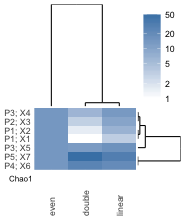

**phyloFlash** runs from multiple libraries can be compared with a heatmap with the `phyloFlash_heatmap.R` script.

The comparison is based on the counts of how many reads map onto each reference sequence, and the taxonomic affiliation of the reference taken from the SILVA taxonomy string. These are the "NTUs" found under the heading "Read mapping based detected higher taxa" in the standard **phyloFlash** output.

Libraries will be clustered by their similarity in terms of taxonomic content. Taxa/NTUs will be clustered by their co-occurrence across samples.

## Quickstart:
```bash
phyloFlash_heatmap.R -h # Show help message
# Run from same folder as phyloFlash output
phyloFlash_heatmap.R -o heatmap.png *.csv
```

## 1. Requirements

Requires `R` and the following packages: `optparse`, `methods`, `grid`, `ggplot2`,
`reshape2`, `ggdendro`, `gtable`.

The script can also be run within the `R` environment.

## 2. Basic heatmap

The input to the `phyloFlash_heatmap.R` script are the .csv outputs from `phyloFlash.pl`. You will need the .csv files from at least two runs to perform the comparison. For simplicity, it is probably easier to copy all the .csv files that you need into a single folder to run the heatmap analysis.

```bash
phyloFlash_heatmap.R -o output.png *.csv
# Alternative: get library names from filenames
phyloFlash_heatmap.R -o output.png --library-name-from-file *.csv
```

Running this in the `test_files` folder will yield a heatmap like this:



## 3. How to interpret the heatmap:

 - Rows represent taxa, columns represent samples.
 - The color scale indicates abundance of taxon by number of reads, scaled as percentages.
 - The heatmap is split by taxonomy into Eukaryota and non-Eukaryota.
 - Taxonomic diversity of the sample is reported as the Chao1 statistic
 - NTUs with counts < 50 are placed together in "Other" by default

## 4. Changing heatmap options

View the full list of options with the help flag

```bash
phyloFlash_heatmap.R -h
```

Here is an overview of the more commonly-used options

### 4.1. Changing output appearance

Cosmetic changes to the output image can be made via the following options for the `phyloFlash_heatmap.R` script:

 - Change colors: `--colors=`, options are steelblue, indianred, green, and orange.
 - Change output image size: `-s SIZExSIZE`
 - Change output format: `-o FILENAME` which must end in either .png or .pdf extensions
 - Choose what components to render in rows `-r`, any combination of `tree`, `map`, `chao`, and `labels`, separated by commas
 - Choose what components to render in columns `-c`, any combination of `labels`, `map`, `tree`, separated by commas
 - Do not shorten taxa names to only the last two fields of taxonomy string; `-l`

### 4.2. Changing clustering parameters

Clustering parameters for both libraries and taxa can be modified.

 - Use absolute values instead of percentages: `-a`
 - Adjust minimum NTU count to not be assigned to "Other": `-n`
 - Change clustering method for samples (`-m`) or taxa (`-M`), choose between `alpha`, `ward`, `single`, `complete`, `average`, `mcquitty`, `median` or `centroid`.
 - Do not split heatmap: `--no-split`
 - Split heatmap by some other regular expression instead of "Eukaryota": `-t REGEX`

### 4.3. Further options and known issues

 - Get library/sample names for heatmap from filenames: `--library-name-from-file`. Otherwise the script will look into the `*report.csv` files to find the corresponding library name
 - The clustering may fail if there is only one taxon
 - Running the comparison script will only give a first overview of your data - the output is dependent on the accuracy and consistency of the taxonomic annotation of the SILVA database. Publication-ready figures will require additional curation, including in most cases a custom database for the organisms being targeted.
