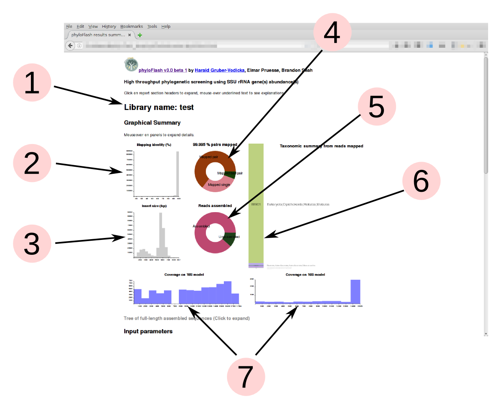
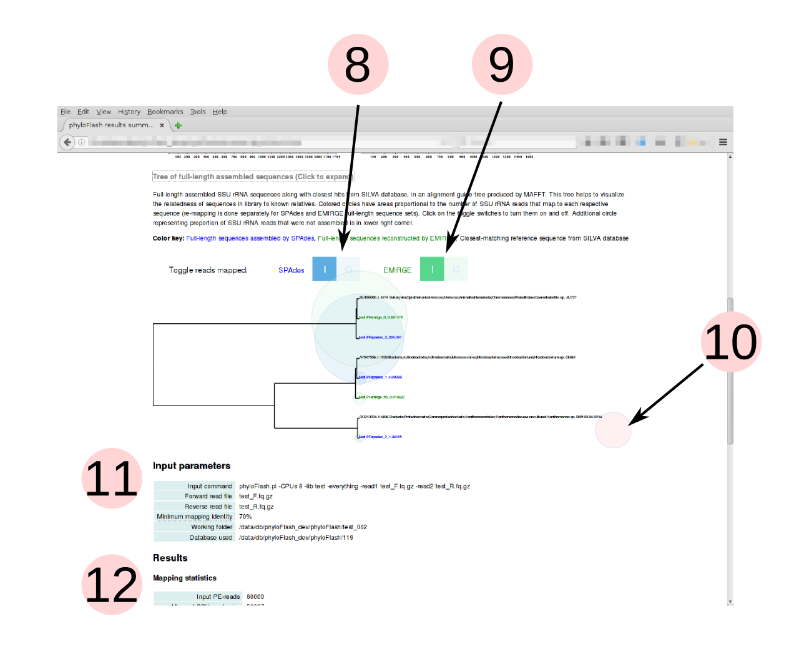

The main output from **phyloFlash** is the report file, in both plaintext and HTML formats. The report summarizes the taxonomic composition of the SSU rRNA reads in the library, and also the full-length sequences assembled or reconstructed from them.

You can view and interact with an example report file from a phyloFlash run with the provided test data [here](test.phyloFlash.html) (use back button on browser to come back to the manual). Plot colors in the bar and pie charts will be different from the example because they are randomly assigned.

## How to read the report file

### Graphical summary

phyloFlash produces a graphical summary of each run in the HTML report file. This gives a quick overview of the taxonomic compositon of the sample from SSU rRNA reads, and also some metrics for evaluating the quality of the sequencel ibrary.

Detailed descriptions of each panel in the graphical summary are visible as tooltip text upon mouseover. 

1. Name of the library, supplied by the `-lib` option
2. Read-mapping %identity of reads vs. reference database from the initial read mapping. Lower %identity hits may indicate presence of divergent taxa not represented in the database.
3. Insert sizes for read pairs. Distribution should generally be unimodal; more than one peak may indicate contamination from other libraries. (Only shown if data are paired-end reads)
4. For single-end read input, the pie shows the proportion of reads mapped to SSU rRNA database. Typically < 1% for metagenomes, ca. 20% for metatranscriptomes without rRNA depletion or poly-A selection. For paired-end input, this shows the ratio of mapped pairs, mapped bad pairs, and mapped single reads where the second segment did not align. Colors are randomly assigned, for aesthetics only.
5. Proportion of reads assembled to full-length sequences. High proportion unassembled suggest either assembly failure or high diversity of organisms with low coverage. Colors are randomly assigned, for aesthetics only. (Only shown if full-length sequences are assembled or reconstructed, i.e. `-skip_spades` and `-noemirge` are not activated)
6. Bar chart of the taxonomic units (NTUs) from the initial read mapping to the SILVA database, arranged in descending order of abundance. The taxonomic level of the NTUs is set by the `-taxlvl` parameter. The number of reads assigned to each taxon is displayed on the bar. Text labels are scaled to the bar heights, but on mouseover of the bars, the corresponding text labels will expand to legible size. Colors are randomly assigned, for aesthetics only.
7. Coverage evenness across eukaryotic 18S rRNA and prokaryotic 16S rRNA gene models from Barrnap, using Nhmmer and a random subsample of mapped reads. This helps to detect contamination from tag sequencing libraries (sharp coverage peaks). For the eukaryotic model it is normal to see one or two regions with low coverage because of variable regions in the 18S rRNA gene that are not present in all organisms. (Only shown if `-poscov` option is used)

8. Tree of full-length SSU rRNA sequences and their closest hits in the SILVA database (guide tree from MAFFT alignment). Relative branch lengths help to assess whether taxa detected in sample are close to known organisms or not. Click on the header to expand the tree. (Only shown if full-length sequences are assembled or reconstructed, i.e. `-skip_spades` and `-noemirge` are not activated)
9. Colored bubbles representing the number of reads mapping to each assembled/reconstructed full-length sequence can be turned on and off with the toggle switches. If both SPAdes and EMIRGE are used, the mapping is done separately for each set of full-length sequences produced by the different tools. This allows a comparison between the tools, e.g. in the example shown, SPAdes assembles a sequence that is not reconstructed by EMIRGE. 
10. Bubble representing SSU rRNA reads that do not map to any of the full-length sequences. These include lower-abundance taxa that are too low in coverage to be assembled.
11. Summary of input parameters supplied to phyloFlash, including the input command
12. Textual summary of results 

### Report tables

Detailed text reports of many of the parameters shown in the graphical summary are presented in tables here. Click on the headers to show or hide each table.

Some fields in the tabular report output are also explained by tooltip text; headings with additional descriptions are indicated by a dotted underline.

## Detailed description of output files

Below is a detailed description of the key output files from phyloFlash. A complete list of all the output and intermediate files produced during a phyloFlash run will be shown by running the command `phyloFlash.pl -outfiles`.

### Report files

These are the main human-readable output from phyloFlash.

 - `LIBNAME.phyloFlash.html` phyloFlash report file in HTML format, with a report on the taxonomic composition of SSU rRNA reads, quality metrics for the library, and affiliation of the reconstructed/assembled full-length sequences.
 - `LIBNAME.phyloFlash` plain text file version of the report

### Unassembled sequence files

Reads that map to the reference database are extracted to these files in Fastq format

 - `LIBNAME.test_F.fq.gz.SSU.1.fq` the filtered SSU reads and their paired read, forward read file  
 - `LIBNAME.test_F.fq.gz.SSU.2.fq` the filtered SSU reads and their paired read, reverse read file  

### Assembled/reconstructed sequence files

Assembled or reconstructed full-length SSU rRNA reads are output unless the `-skip_spades` or `-skip_emirge` options are used.

 - `LIBNAME.spades_rRNAs.final.fasta ` assembled OTUs from SPAdes with *phyloFlash* simplified headers

 - `LIBNAME.emirge.final.phyloFlash.notmatched.fa` a fasta file with the reconstructed SSU sequences with no significant hit in the provided SSU database
 - `LIBNAME.emirge.final.fa` a fasta file with the Emirge reconstructed SSU OTUs
 - `LIBNAME.emirge.final.phyloFlash.dbhits.fa` a fasta file with the best hits for the reconstructed SSU sequences in the provided SSU database

 - `LIBNAME.all.final.fasta` All assembled and reconstructed sequences from SPAdes and/or EMIRGE in a single file
 - `LIBNAME.all.final.phyloFlash.dbhits.fa`
 - `LIBNAME.all.final.phyloFlash.notmatched.fa`

 - `LIBNAME.all.dbhits.NR97.fa` Reference sequences from database with hits from the supplied reads, clustered at 97% identity

### Alignments

 - `LIBNAME.SSU.collection.alignment.fasta` an aligned multifasta of all the predicted OTUs and the references
 - `LIBNAME.SSU.collection.fasta` a multifasta of all the predicted OTUs and the references
 - `LIBNAME.SSU.collection.fasta.tree` an NJ tree of the mafft alignment of all the predicted OTUs and the references. PDF and PNG versions are created for the HTML report if the `-html` option is set

### Other statistics

 - `LIBNAME.inserthistogram` Histogram of detected insert sizes in tab-separated format, if paired-end reads were input. PDF and PNG versions are created for the HTML report if the `-html` option is set
 - `LIBNAME.idhistogram` Histogram of the % identity of reads vs. reference database sequences, in tab-separated format. PDF and PNG versions are created for the HTML report if the `-html` option is set
 - `LIBNAME.phyloFlash.NTUabundance.csv` the list of uniqe higher level taxa (e.g. orders for bacteria) in the order of their appearance

 - `LIBNAME.scaffolds.arch.gff` 16S rRNA gene predictions for assembled OTUs based on archaeal SSU rRNA hmm profile  
 - `LIBNAME.scaffolds.bac.gff` 16S rRNA gene predictions for assembled OTUs based on bacterial SSU rRNA hmm profile  
 - `LIBNAME.scaffolds.euk.gff` 18S rRNA gene predictions for assembled OTUs based on eukaryote SSU rRNA hmm profile

### CSV files used for multiple-sample comparison

These files are used by the `phyloFlash_heatmap.R` script if you wish to compare multiple samples by their taxonomic composition.

 - `LIBNAME.phyloFlash.NTUabundance.csv`
 - `LIBNAME.phyloFlash.report.csv`

### Log files

The main phyloFlash log file is saved as `LIBNAME.phyloFlash.log` if the `-log` option was chosen. This simply writes the messages displayed on the screen to a file after the run is complete. 

Log files from the various tools used by the pipeline. If individual steps fail these can help to diagnose the problem.

 - `LIBNAME.barrnap.out` barrnap log  
 - `LIBNAME.bbmap.out` the bbmap log
 - `LIBNAME.spades.out` SPAdes log  
 - `LIBNAME.emirge.out` EMIRGE log
